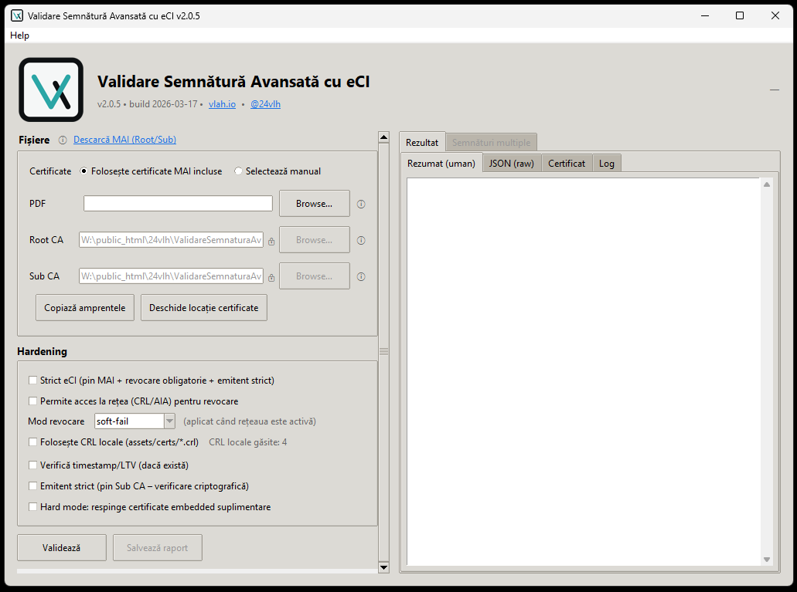

# ValidareSemnatura-eCI (Windows)



## Pe scurt

**ValidareSemnatura-eCI** este o aplicație Windows portabilă (executabil `.exe`) care verifică dacă un PDF a fost semnat corect cu **certificatul de semnătură electronică avansată din Cartea Electronică de Identitate (CEI)**, emis de MAI.

Aplicația face **doar validare tehnică criptografică**:
– integritatea semnăturii
– validitatea lanțului de certificate
– încrederea în Root CA + Sub CA MAI
– (opțional) emitentul exact al certificatului semnatar

Nu autentifică persoane, nu face login, nu trimite date și nu modifică documente.

**Notă rețea / confidențialitate:**
Aplicația **nu trimite niciodată PDF-ul** și nu încarcă documente.
Poți alege verificarea revocării fie prin **rețea** (CRL/AIA/OCSP), fie folosind **CRL locale** din `assets/certs/*.crl`.
Dacă activezi opțiunea de rețea, aplicația poate face **cereri HTTP** către URL‑uri publicate în certificate pentru verificarea revocării sau a lanțului.
Aceste cereri nu conțin documentul, doar cer informații despre certificate.

---

## Cel mai important lucru de știut (eCI only)

Aplicația este construită **strict pentru semnături eCI** (Root/Sub MAI).

- Dacă un PDF are semnături mixte (ex: eCI + alt certificat calificat / eSeal / altă CA), atunci:
  - cu **Root/Sub MAI** încărcate, semnăturile eCI pot fi VALID, iar cele non‑eCI vor fi INVALID.
  - dacă încarci **alte Root/Sub** (non‑MAI), semnăturile eCI vor apărea INVALID.

Concluzie: rezultatele sunt corecte doar dacă **toate semnăturile** sunt așteptate să provină din eCI.

---

## Cum se folosește (GUI – recomandat)

1. Rulează `ValidareSemnatura-eCI.exe`
2. Alege sursa certificatelor:
   - certificate MAI incluse (assets/certs) **sau**
   - selectare manuală (Root CA + Sub CA)
3. Selectează:
   - PDF-ul semnat
   - certificatul Root CA
   - certificatul Sub CA
4. (Opțional) bifează opțiunile dorite (rețea, revocare, emitent strict, strict eCI, CRL local, timestamp).
5. Apasă **Validează**
6. Primești rezultatul **VALID / INVALID + detalii complete**
   - tabul **Certificat** afișează Subject/Issuer/SHA256 + EKU/Policy OIDs
   - poți copia detaliile certificatului sau exporta certificatul semnatarului
   - dacă există **mai multe semnături**, apare tabul **Semnături multiple**
     cu status pentru fiecare semnătură + export/copie pe semnătură

---

## Ce verifică (tehnic)

1. **Integritatea semnăturii**
   – documentul nu a fost modificat după semnare

2. **Validitatea criptografică**
   – semnătura este matematic corectă

3. **Lanțul de încredere**
   – semnătura duce la Root CA MAI prin Sub CA MAI

4. **Certificatul semnatarului**
   – extrage DN-ul și amprenta SHA256

5. **(Opțional) Emitent strict**
   – respinge semnătura dacă NU este emisă exact de Sub CA-ul furnizat

6. **Semnături multiple**
   – dacă PDF-ul are mai multe semnături, aplicația le verifică pe fiecare separat

---

## Opțiuni importante

- **Acces la rețea (CRL/AIA/OCSP)**
  – permite verificări de revocare folosind URL‑urile din certificate
- **CRL local (assets/certs/*.crl)**
  – verificare revocare fără internet (dacă ai CRL‑urile local)
- **Mod revocare**
  – soft‑fail / hard‑fail / require (se aplică atunci când rețeaua este activă)
- **Emitent strict (pin Sub CA)**
  – respinge semnătura dacă emitentul nu este exact Sub CA-ul furnizat
- **Mod strict eCI**
  – pin Root/Sub la amprentele MAI + revocare obligatorie
- **Verificare timestamp/LTV (dacă există)**
  – cere un timestamp valid și de încredere; altfel semnătura va eșua

---

## Certificatele MAI

Certificatele Root și Sub CA se pot descărca oficial de aici:

https://hub.mai.gov.ro/cei/info/descarca-cert

Aplicația este compatibilă cu fișiere:
- `.cer`
- `.crt`
- `.pem`

### Certificate incluse (assets/certs)

Dacă alegi varianta „certificate incluse”, aplicația folosește aceste fișiere:

| Fișier | SHA256 |
|---|---|
| `ro_cei_mai_root-ca.cer` | `b7a766f52218c8083e936f9ab085e97c67671ecd4fd3069b641c638072e44b1d` |
| `ro_cei_mai_sub-ca.cer` | `b512f92a6d156008d93ab5ff9690be874afc3401ce0306f477f187799593da80` |

Aplicația afișează aceste amprente în UI și îți permite să le copiezi rapid.

---

## Verificare timestamp/LTV (opțional)

Când este activată, aplicația cere un **timestamp valid și de încredere** în semnătură (sau content timestamp).
Dacă nu există timestamp sau acesta nu este valid/trusted, validarea eșuează.

Limitare: această verificare nu înlocuiește validarea completă LTV la momentul semnării și nu poate garanta statutul legal
în timp; este un control tehnic asupra token‑ului de timestamp.

---

## Mod CLI (opțional)

Aplicația poate fi folosită și din linia de comandă:

```bash
ValidareSemnatura-eCI.exe --pdf document.pdf --root root.cer --sub sub.cer
```

Pentru output JSON:

```
--json
```

Pentru a salva output-ul într-un fișier:
```
--output raport.json
```

Notă: dacă folosești `--output` fără `--json`, fișierul va conține textul uman (identic cu cel afișat în consolă).

Pentru a nu mai afișa output în consolă (doar în fișier):
```
--no-stdout
```
Notă: `--no-stdout` necesită `--output`.

---

## Descărcare și utilizare (Windows)

### 1. Descarcă aplicația
Descarcă prima versiune oficială de aici:

👉 https://github.com/24vlh/Validare-Sematura-eCI/releases/download/v2.0.1/ValidareSemnatura-eCI-v2.0.1.zip

---

### 2. Dezarhivează
– click dreapta pe fișierul ZIP
– **Extract All / Extrage tot**
– alege un folder (ex: Desktop)

---

### 3. Rulează aplicația
În folderul extras:
- dublu-click pe **ValidareSemnatura-eCI.exe**
- aplicația pornește direct (nu necesită instalare)

---

### 4. Dacă apare avertisment Windows
Este normal pentru aplicații portabile ne-semnate:

1. Click **More info / Mai multe informații**
2. Click **Run anyway / Rulează oricum**

Aplicația este locală, offline și nu modifică sistemul.

---

### 5. Folosire rapidă
1. Selectează PDF-ul semnat
2. Selectează certificatele Root + Sub CA MAI
3. Apasă **Validează**
4. Primești rezultatul instant

---

### Dezinstalare
Șterge pur și simplu folderul.
Nu rămâne nimic instalat în sistem.

---

## Limitări (intenționate)

Aceasta **NU** este:
- aplicație de producție
- aplicație certificată
- aplicație juridică oficială
- înlocuitor pentru servicii de încredere calificate
- instrument de autentificare a persoanei

Este un **instrument de verificare tehnică**, creat pentru claritate, control și transparență.

### Mod strict eCI (opțional)
Modul strict eCI activează automat:
- pinning Root/Sub la amprentele oficiale MAI
- revocare obligatorie (CRL/OCSP)
- emitent strict (pin Sub CA)

Opțional, poți configura filtrarea EKU/Policy OID direct în cod (`ECI_REQUIRED_EKU_OIDS`, `ECI_REQUIRED_POLICY_OIDS`).

---

## Disclaimer

Această aplicație este oferită **ca utilitar tehnic de ajutor**, fără garanții explicite sau implicite.
Rezultatul este informativ și nu substituie evaluarea juridică sau procedurală oficială.

Folosirea aplicației este pe propria răspundere.

---

## Filosofie

Un document semnat electronic trebuie să poată fi verificat:
- local
- independent
- fără cont
- fără furnizor
- fără magie

Această aplicație face exact asta.
**Nimic mai mult. Nimic mai puțin.**

---

## Verificare integritate & autenticitate fișiere

Pentru a putea verifica că arhiva și executabilul provin **exact din build-ul publicat de mine** și nu au fost modificate, mai jos sunt amprentele criptografice complete ale fișierelor.

Poți recalcula aceste hash-uri local (cu `certutil`, `sha256sum`, `7zip`, etc.) și compara rezultatul.

---

### ValidareSemnatura-eCI-v2.0.2-portable.exe (one-file build)

**Dimensiune:** 29,546,746 bytes
**Data build:** 31/01/2026 10:10:47

| Algoritm | Hash |
|---------|------|
| MD5 | `adf366b807cd4f834a9b3dd2716eeedf` |
| SHA1 | `123c6963e00594da33e2e6a638ea87030686ff87` |
| CRC32 | `01387a30` |
| SHA256 | `90095ba62842a31de3236b29eee2848f7b8a660ec8d217cfd950d949e1b43ead` |
| SHA512 | `635ebaf24cdf458a83b8a205a604849806e6da7a2b8375a19a129bd1f780e38d56a805981f2705f5e2f752151003ea545c69c32211aafa611727c4ff34c25d20` |
| SHA3-256 | `7fbb0520a4afe0f680e4b45fd6468a7aa8599bd107cb65b04177ed63e95df98267c4b18362468e8ec85712113d856899` |

---

### ValidareSemnatura-eCI-v2.0.2-portable-folder-build.zip

**Dimensiune:** 29,822,438 bytes
**Data build:** 31/01/2026 10:11:25

| Algoritm | Hash |
|---------|------|
| MD5 | `870eb89376f543142e248e70abf33277` |
| SHA1 | `89712ce3c7839db105bc003f007e188643544823` |
| CRC32 | `17aee3c7` |
| SHA256 | `dc8d254e2ff49663f616a54113364a388cf8fc812078792395eeac94d4dfc8ee` |
| SHA512 | `3ccf0e6385a5f360003d2e19565773b4af531e497cdedcf86a7b8ccb3e4f760da6a7835eb88845b6488b16e121ebf3fd4579f0983545d88bd3ebeaddba3e562f` |
| SHA3-256 | `f3e21a9c2957cf7941341f28cd3f96e00c7205b128fd90239e93a272fecdf2ae75e0f9bf942426fca51fa1e227b9d07e` |

Notă: această arhivă ZIP conține **varianta folder build** (executabilul + dependențele din folder).

---

### ValidareSemnatura-eCI.exe v2.0.2 (folder build)

**Dimensiune:** 6,880,569 bytes
**Data build:** 31/01/2026 10:10:29

| Algoritm | Hash |
|---------|------|
| MD5 | `1ae752b23501a595c07c22b6f354e657` |
| SHA1 | `695246cb24ede181b792d54037a92da95e0d551c` |
| CRC32 | `076137e0` |
| SHA256 | `a6631a486834d300cb213067d13f98a4b86be406cb5625a9f2ee1a5ed60ce067` |
| SHA512 | `86791c8226c2bf37a31f7a7f67021ca3b08a3c314eaf0a98ba6505b24c69d42fb9daacb68ebef32b54a857a47e43bc5187681ce5154d06936087474f549fe5e9` |
| SHA3-256 | `631039d3abc9b2fc1264f289b2ad17c19338604f86864a4d04263bfaf52d24fdbb0baa6ba9ea004e75bf5a53b452b098` |

---

### Exemplu verificare pe Windows

```powershell
certutil -hashfile ValidareSemnatura-eCI-v2.0.2-portable.exe SHA256
certutil -hashfile ValidareSemnatura-eCI-v2.0.2-portable-folder-build.zip SHA256
certutil -hashfile ValidareSemnatura-eCI.exe SHA256
```

**Notă:**
Aceste hash-uri sunt publicate pentru transparență și verificabilitate.
Dacă nu se potrivesc, **nu rula aplicația** și descarcă din nou arhiva doar din secțiunea oficială GitHub: https://github.com/24vlh/Validare-Sematura-eCI/releases.
