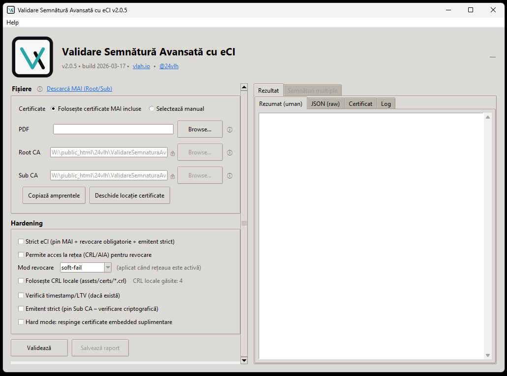

# ValidareSemnaturaAvansata-eCI (Windows)



## Pe scurt

### [Descărcare](https://github.com/24vlh/ValidareSemnaturaAvansata-eCI/releases/download/v2.0.4/ValidareSemnaturaAvansata-eCI-v2.0.4-portable-folder-build.zip)

**ValidareSemnaturaAvansata-eCI** este o aplicație Windows portabilă (executabil `.exe`) care verifică dacă un PDF a fost semnat corect cu **certificatul de semnătură electronică avansată din Cartea Electronică de Identitate (CEI)**, emis de MAI.

Aplicația face **doar validare tehnică criptografică**:
– integritatea semnăturii
– validitatea lanțului de certificate
– încrederea în Root CA + Sub CA MAI
– (opțional) emitentul exact al certificatului semnatar

Nu autentifică persoane, nu face login, nu trimite date și nu modifică documente.

**Notă rețea / confidențialitate:**
Aplicația **nu trimite niciodată PDF-ul** și nu încarcă documente.
Poți alege verificarea revocării fie prin **rețea** (CRL/AIA/OCSP), fie folosind **CRL locale** din `assets/certs/*.crl`.
Dacă activezi opțiunea de rețea, aplicația poate face **cereri HTTP** către URL‑uri publicate în certificate pentru verificarea revocării sau a lanțului.
Aceste cereri nu conțin documentul, doar cer informații despre certificate.

---

## Cel mai important lucru de știut (eCI only)

Aplicația este construită **strict pentru semnături eCI** (Root/Sub MAI).

- Dacă un PDF are semnături mixte (ex: eCI + alt certificat calificat / eSeal / altă CA), atunci:
  - cu **Root/Sub MAI** încărcate, semnăturile eCI pot fi VALID, iar cele non‑eCI vor fi INVALID.
  - dacă încarci **alte Root/Sub** (non‑MAI), semnăturile eCI vor apărea INVALID.

Concluzie: rezultatele sunt corecte doar dacă **toate semnăturile** sunt așteptate să provină din eCI.

---

## Cum se folosește (GUI – recomandat)

1. Rulează `ValidareSemnaturaAvansata-eCI.exe`
2. Alege sursa certificatelor:
   - certificate MAI incluse (assets/certs) **sau**
   - selectare manuală (Root CA + Sub CA)
3. Selectează:
   - PDF-ul semnat
   - certificatul Root CA
   - certificatul Sub CA
4. (Opțional) bifează opțiunile dorite (rețea, revocare, emitent strict, strict eCI, CRL local, timestamp).
5. Apasă **Validează**
6. Primești rezultatul **VALID / INVALID + detalii complete**
   - tabul **Certificat** afișează Subject/Issuer/SHA256 + EKU/Policy OIDs
   - poți copia detaliile certificatului sau exporta certificatul semnatarului
   - dacă există **mai multe semnături**, apare tabul **Semnături multiple**
     cu status pentru fiecare semnătură + export/copie pe semnătură

---

## Ce verifică (tehnic)

1. **Integritatea semnăturii**
   – documentul nu a fost modificat după semnare

2. **Validitatea criptografică**
   – semnătura este matematic corectă

3. **Lanțul de încredere**
   – semnătura duce la Root CA MAI prin Sub CA MAI

4. **Certificatul semnatarului**
   – extrage DN-ul și amprenta SHA256

5. **(Opțional) Emitent strict**
   – respinge semnătura dacă NU este emisă exact de Sub CA-ul furnizat

6. **Semnături multiple**
   – dacă PDF-ul are mai multe semnături, aplicația le verifică pe fiecare separat

---

## Opțiuni importante

- **Acces la rețea (CRL/AIA/OCSP)**
  – permite verificări de revocare folosind URL‑urile din certificate
- **CRL local (assets/certs/*.crl)**
  – verificare revocare fără internet (dacă ai CRL‑urile local)
- **Mod revocare**
  – soft‑fail / hard‑fail / require (se aplică atunci când rețeaua este activă)
- **Emitent strict (pin Sub CA)**
  – respinge semnătura dacă emitentul nu este exact Sub CA-ul furnizat
- **Mod strict eCI**
  – pin Root/Sub la amprentele MAI + revocare obligatorie
- **Verificare timestamp/LTV (dacă există)**
  – cere un timestamp valid și de încredere; altfel semnătura va eșua

---

## Certificatele MAI

Certificatele Root și Sub CA se pot descărca oficial de aici:

https://hub.mai.gov.ro/cei/info/descarca-cert

Aplicația este compatibilă cu fișiere:
- `.cer`
- `.crt`
- `.pem`

### Certificate incluse (assets/certs)

Dacă alegi varianta „certificate incluse”, aplicația folosește aceste fișiere:

| Fișier | SHA256 |
|---|---|
| `ro_cei_mai_root-ca.cer` | `b7a766f52218c8083e936f9ab085e97c67671ecd4fd3069b641c638072e44b1d` |
| `ro_cei_mai_sub-ca.cer` | `b512f92a6d156008d93ab5ff9690be874afc3401ce0306f477f187799593da80` |

Aplicația afișează aceste amprente în UI și îți permite să le copiezi rapid.

---

## Verificare timestamp/LTV (opțional)

Când este activată, aplicația cere un **timestamp valid și de încredere** în semnătură (sau content timestamp).
Dacă nu există timestamp sau acesta nu este valid/trusted, validarea eșuează.

Limitare: această verificare nu înlocuiește validarea completă LTV la momentul semnării și nu poate garanta statutul legal
în timp; este un control tehnic asupra token‑ului de timestamp.

---

## Mod CLI (opțional)

Aplicația poate fi folosită și din linia de comandă:

```bash
ValidareSemnaturaAvansata-eCI.exe --pdf document.pdf --root root.cer --sub sub.cer
```

Pentru output JSON:

```
--json
```

Pentru a salva output-ul într-un fișier:
```
--output raport.json
```

Notă: dacă folosești `--output` fără `--json`, fișierul va conține textul uman (identic cu cel afișat în consolă).

Pentru a nu mai afișa output în consolă (doar în fișier):
```
--no-stdout
```
Notă: `--no-stdout` necesită `--output`.

---

## Descărcare și utilizare (Windows)

### 1. Descarcă aplicația
Descarcă prima versiune oficială de aici:

👉 https://github.com/24vlh/ValidareSemnaturaAvansata-eCI/releases/download/v2.0.4/ValidareSemnaturaAvansata-eCI-v2.0.4-portable-folder-build.zip

---

### 2. Dezarhivează
– click dreapta pe fișierul ZIP
– **Extract All / Extrage tot**
– alege un folder (ex: Desktop)

---

### 3. Rulează aplicația
În folderul extras:
- dublu-click pe **ValidareSemnaturaAvansata-eCI.exe**
- aplicația pornește direct (nu necesită instalare)

---

### 4. Dacă apare avertisment Windows
Este normal pentru aplicații portabile ne-semnate:

1. Click **More info / Mai multe informații**
2. Click **Run anyway / Rulează oricum**

Aplicația este locală, offline și nu modifică sistemul.

---

### 5. Folosire rapidă
1. Selectează PDF-ul semnat
2. Selectează certificatele Root + Sub CA MAI
3. Apasă **Validează**
4. Primești rezultatul instant

---

### Dezinstalare
Șterge pur și simplu folderul.
Nu rămâne nimic instalat în sistem.

---

## Limitări (intenționate)

Aceasta **NU** este:
- aplicație de producție
- aplicație certificată
- aplicație juridică oficială
- înlocuitor pentru servicii de încredere calificate
- instrument de autentificare a persoanei

Este un **instrument de verificare tehnică**, creat pentru claritate, control și transparență.

### Mod strict eCI (opțional)
Modul strict eCI activează automat:
- pinning Root/Sub la amprentele oficiale MAI
- revocare obligatorie (CRL/OCSP)
- emitent strict (pin Sub CA)

Opțional, poți configura filtrarea EKU/Policy OID direct în cod (`ECI_REQUIRED_EKU_OIDS`, `ECI_REQUIRED_POLICY_OIDS`).

---

## Disclaimer

Această aplicație este oferită **ca utilitar tehnic de ajutor**, fără garanții explicite sau implicite.
Rezultatul este informativ și nu substituie evaluarea juridică sau procedurală oficială.

Folosirea aplicației este pe propria răspundere.

---

## Filosofie

Un document semnat electronic trebuie să poată fi verificat:
- local
- independent
- fără cont
- fără furnizor
- fără magie

Această aplicație face exact asta.
**Nimic mai mult. Nimic mai puțin.**

---

## Verificare integritate & autenticitate fișiere

Pentru a putea verifica că arhiva și executabilul provin **exact din build-ul publicat de mine** și nu au fost modificate, mai jos sunt amprentele criptografice complete ale fișierelor.

Poți recalcula aceste hash-uri local (cu `certutil`, `sha256sum`, `7zip`, etc.) și compara rezultatul.

---

### ValidareSemnaturaAvansata-eCI-v2.0.4-portable.exe (one-file build)

**Dimensiune:** 29,546,853 bytes
**Data build:** 14/03/2026 14:45:08

| Algoritm | Hash |
|---------|------|
| MD5 | `6b0ff8819985cf338ae9ae9848bf4541` |
| SHA1 | `8a20b15eee20bdf8528b2218f363baf238d1eaa8` |
| CRC32 | `d2cc815b` |
| SHA256 | `acdd7cecd6f0bccbb12daa7bf83e4f0191d1c568123c1f40ffdc2422c9ec83f1` |
| SHA512 | `c738d6e8682730ee27bb12822621bd73d3f481ea3e38e4fb7faf685cede2c82dde1fa241ffc54a89178bbe9f15a0f7d32186be3c25db66e0e9ff582b1337ee58` |
| SHA384 | `3b035b5a7301e292b2cfa88cc80ba33a256464bca04567204d811bb8b1a6fd561d78e6bfa8e3a9229ed2322e07ea0fec` |

---

### ValidareSemnaturaAvansata-eCI-v2.0.4-portable-folder-build.zip

**Dimensiune:** 29,721,210 bytes
**Data build:** 14/03/2026 14:44:38

| Algoritm | Hash |
|---------|------|
| MD5 | `9c7e136ba61e3ab8d1cb122a33ca1da0` |
| SHA1 | `fde3de9a26c0be4f37d8ada9774d40eafe02ca8c` |
| CRC32 | `1417c883` |
| SHA256 | `8a490a8c507481f997027c955e1b7faa1e02bc8bf971be71cb71bc5a57447eee` |
| SHA512 | `890c29a987fe29a4cf8cfe12c8faf81e5baf9d8859f8678c90a3b22c252bb0080554641cc7f5970b360b24256a789996beb9456911fc947f2bbbab5a5abbb9d7` |
| SHA384 | `5f0a5c7adaaed404a5080d50ab21a20f2306489bda10742fa1b7e54e570146cfff3dd267537bcfec0be742875e30eb42` |

Notă: această arhivă ZIP conține **varianta folder build** (executabilul + dependențele din folder).

---

### ValidareSemnaturaAvansata-eCI.exe v2.0.4 (folder build)

**Dimensiune:** 6,881,188 bytes
**Data build:** 14/03/2026 14:43:46

| Algoritm | Hash |
|---------|------|
| MD5 | `554e9d4037959f53e936b5fb811f7d5d` |
| SHA1 | `ca90c1e48814b05db0a9d04a3dcd4e74a0f844f8` |
| CRC32 | `50478542` |
| SHA256 | `4175eeb97c88cb93183bb2200beed54569ed356957feec155d7a3c6f7a696e6f` |
| SHA512 | `48644b44a4566113d752240bb6090aaedbe9b6d4f94b0a12b63f5c0927fe08ac8bc8d84c38ad0ebf92753cd11f04f9714f7234d221ca1fd6e967489734ecaa44` |
| SHA384 | `56b9529fe3be489a72a1ced51eff5086fed9343f0b62e0f9df841886b56d76e70f920965916ae2d9ddb9d15ee5424e16` |

---

### Exemplu verificare pe Windows

```powershell
certutil -hashfile ValidareSemnaturaAvansata-eCI-v2.0.4-portable.exe SHA256
certutil -hashfile ValidareSemnaturaAvansata-eCI-v2.0.4-portable-folder-build.zip SHA256
certutil -hashfile ValidareSemnaturaAvansata-eCI.exe SHA256
```

**Notă:**
Aceste hash-uri sunt publicate pentru transparență și verificabilitate.
Dacă nu se potrivesc, **nu rula aplicația** și descarcă din nou arhiva doar din secțiunea oficială GitHub: https://github.com/24vlh/ValidareSemnaturaAvansata-eCI/releases.
